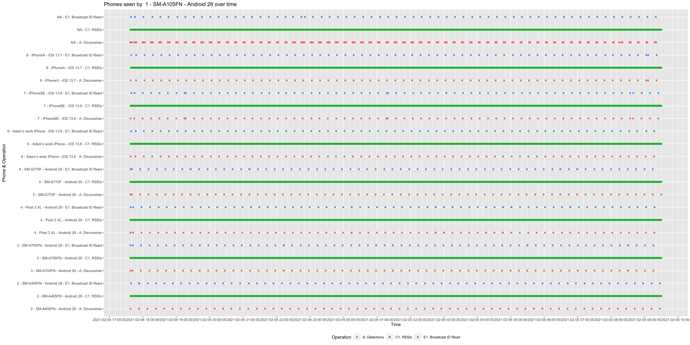
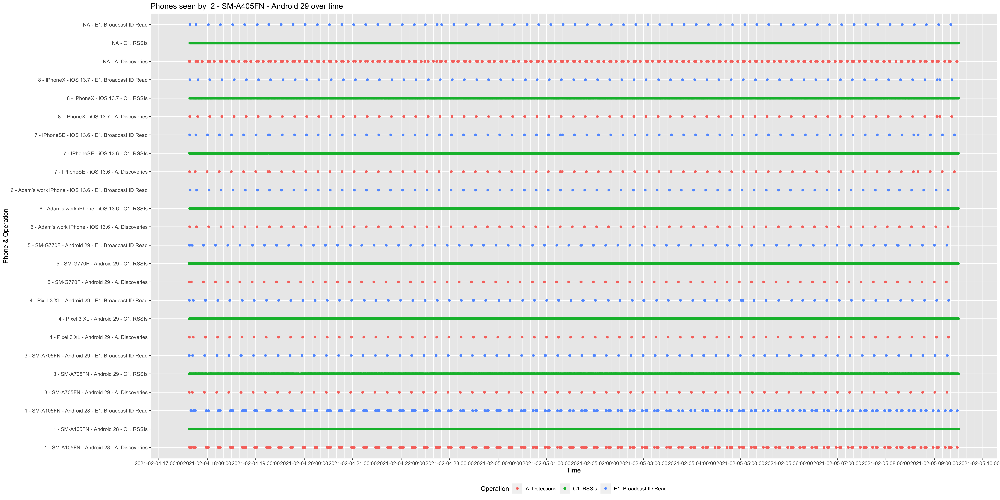
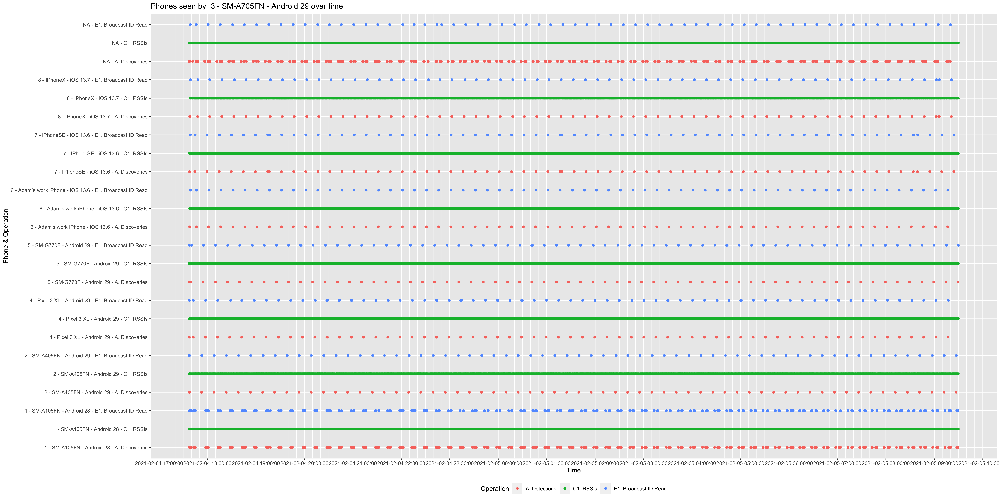
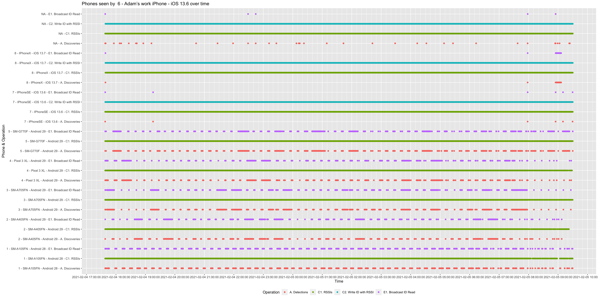
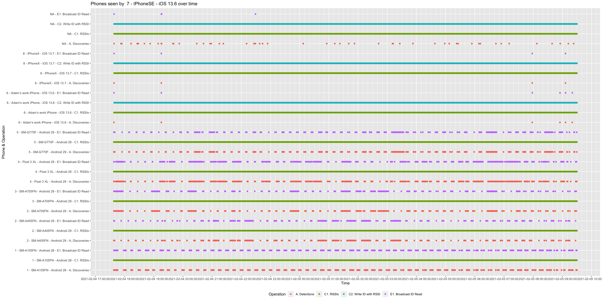
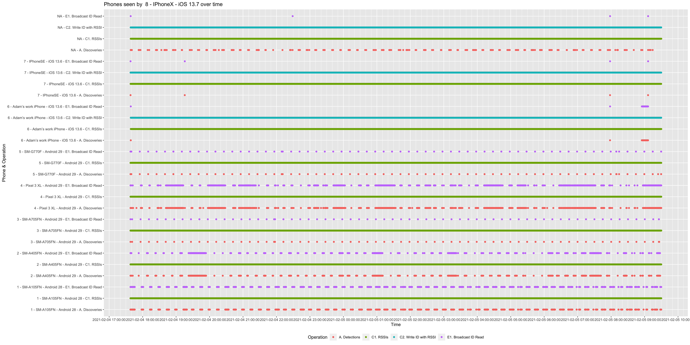

# What is Herald?
Contact tracing apps use your mobile phone’s Bluetooth to detect and record other devices. There are different protocols to leverage Bluetooth for contact tracing and Herald is one of these protocols. 

For more information, please visit https://vmware.github.io/herald/ 

# How is Herald different from other Bluetooth contact tracing protocols? 
Herald improves encounter logging of other devices when the devices are locked. By implementing Herald, the ABTT app is able to successfully log all encounters between a mix of Android and iOS devices even when the devices were locked. Herald is able to support a wider variety of phone and older models and operating systems to increase equitable access. Herald supports wearable technologies to enable contact tracing for vulnerable and underserved populations and environments in which a Bluetooth-enabled mobile device is not usable.

# What is the efficacy of Herald?
A formula was developed to gauge the efficacy of a Bluetooth contact tracing app to trace contacts and help control the spread of COVID-19 on an epidemiological level.The ranges of the efficacy of a Bluetooth protocol is as follows: 
- Very Effective: 57%+
- Effective: 30%-56%
- Limited effectiveness: 10%-29%
- Not effective: under 10%

The ABTraceTogether app with Herald integration scored 45.49% regardless of the phone being in a locked or unlocked state. To-date, this is the highest score of Herald when implemented in a contact tracing mobile app worldwide.

For more information on the formula, visit the Herald website to read the Efficacy Measure and related fair efficacy formula paper at https://vmware.github.io/herald/efficacy/

# How can I report issues found with the ABTraceTogether app and contribute to its development?
The ABTraceTogether app is open source. If you find issues or have ideas to improve the app, you can submit your feedback to Github.

For iOS: https://github.com/abopengov/contact-tracing-iOS
For Android: https://github.com/abopengov/contact-tracing-Android 

# How is Herald involved in the larger scope of combatting COVID-19?

Herald was developed as a VMware-originated open-source project and has now been donated to the Linux Foundation Public Health initiative where it is the most active project.  The Linux Foundation Public Health aims to use open-source technologies to help public health authorities across the world combat COVID-19 and future epidemics.

Public Health Authorities and technology partners are encouraged to join the foundation to collaborate and shape the future for public health worldwide. 

For more information, please visit https://www.lfph.io/ 

# Our test results

The below 8 charts show discoveries, ID (data payload) reads, and RSSI (distance estimation) readings as individual dots.

